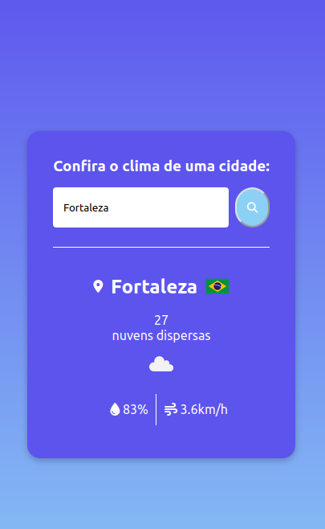

# Aplicativo Clima

Este é um aplicativo simples que permite aos usuários verificar as informações de clima de uma cidade específica.

## Visão Geral

Este aplicativo foi desenvolvido para permitir aos usuários obter informações de clima de uma cidade, incluindo a temperatura atual, descrição do clima, um ícone representando as condições climáticas, país, umidade e velocidade do vento.

## Instruções

1. Abra o arquivo `index.html` em um navegador da web.

2. Na página, insira o nome da cidade na caixa de texto.

3. Clique no botão "Pesquisar" para obter informações de clima para a cidade inserida.

4. Os resultados serão exibidos na página, incluindo o nome da cidade, temperatura, descrição do clima, ícone de condições climáticas, umidade e velocidade do vento.

## Tecnologias Usadas

- HTML
- JavaScript
- CSS
- API OpenWeatherMap
- Font Awesome (para ícones)
- Flags API

## Foto do Aplicativo

